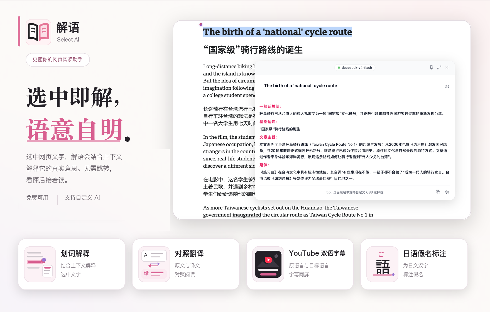
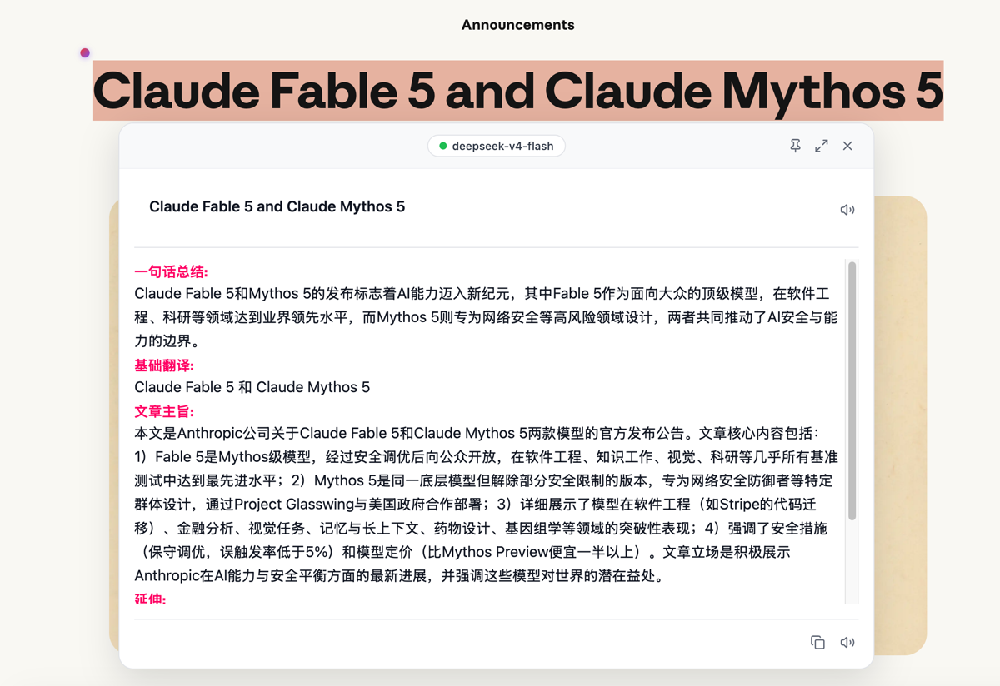
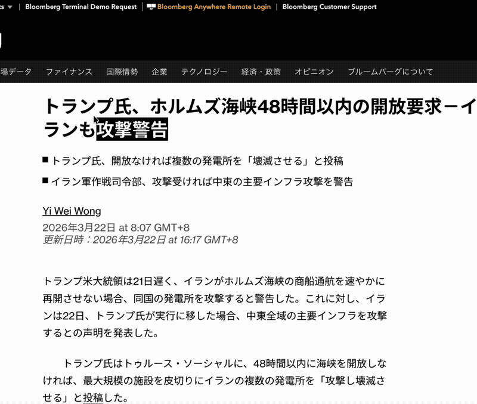
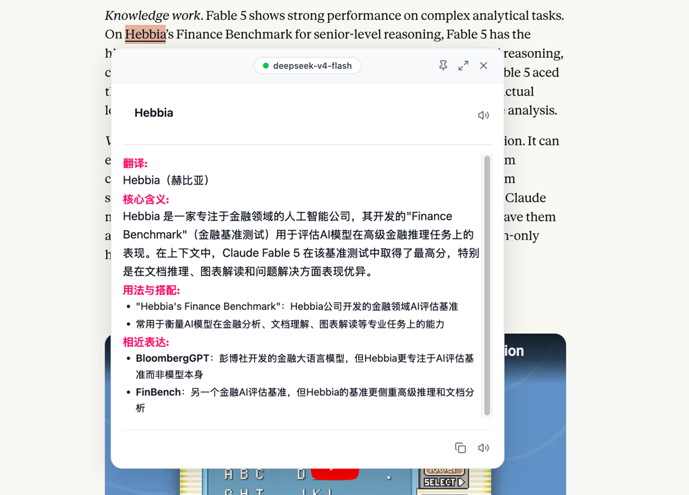
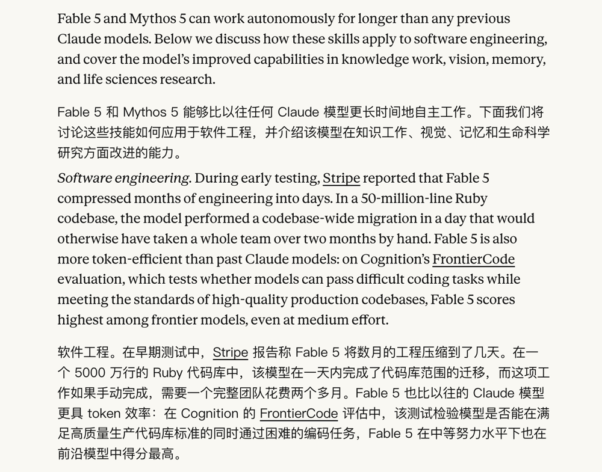
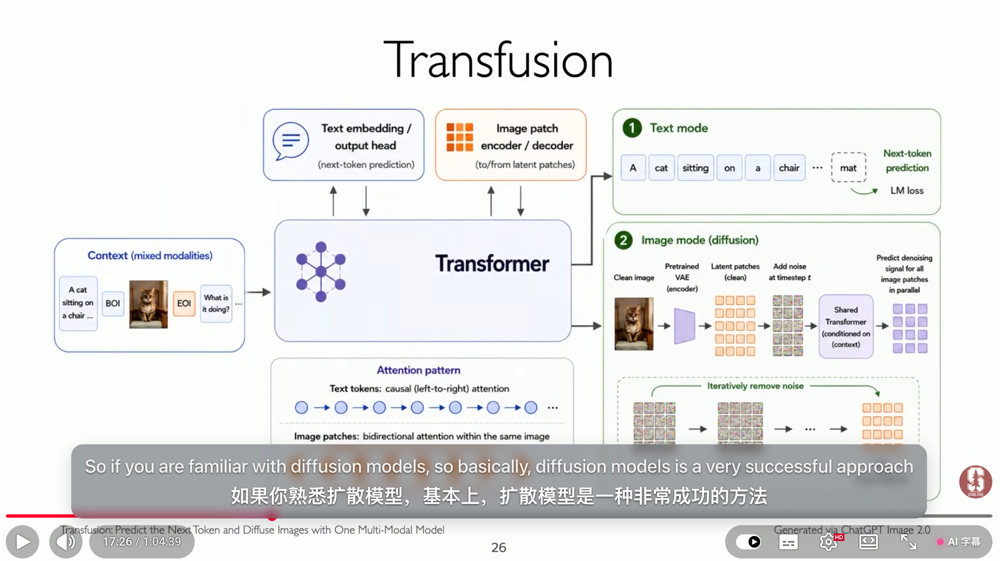
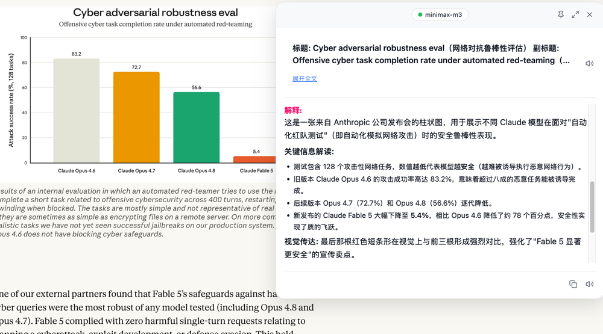

<h1> Select AI</h1>

[](https://chromewebstore.google.com/detail/select-ai-ai%E5%88%92%E8%AF%8D%E8%A7%A3%E9%87%8A/ehcjdmkcnjniaofflhghckpgmjmbgkjh) [](https://microsoftedge.microsoft.com/addons/detail/select-ai-explain-tra/ihmkejknobkglabjodamfigdhafohcde) [](https://addons.mozilla.org/en-US/firefox/addon/select-ai-explain-translate/) [](https://select-ai.cn)  [](./CHANGELOG.md) [](./CHANGELOG.md) [](./README.zh-CN.md)

<p align="center">
  
</p>


<p align="center">
  <strong>💛 Support the project</strong><br/>
  <sub>Solo indie project, no ads. If Select AI helped you, consider buying me a cola.</sub><br/>
  
</p>

---

<p align="center">
  
</p>

<p align="center">
  
</p>

## 🎯 Select Any Text. Get It Explained.

> **Select text, AI understands context, gives you the answer.**

Reading in a foreign language and hit an unfamiliar word? The usual routine — copy, switch apps, paste, wait — breaks your flow and often gives you an isolated definition that doesn't fit the sentence.

**Select AI is not just another dictionary.** It's an AI understanding layer that lives inside the webpage. Select any text, click the floating button, and get a context-aware explanation right where you are reading — no tab switching, no interruption.

No signup. No API key required. Install and go.

---

## ✨ What It Does

### 1. Context-Aware Selection Explainer

Select text on any webpage. Select AI analyzes surrounding context and tells you what it means — not just a translation, but an explanation that fits the context.

<p align="center">
  
</p>

- Detects whether you selected a term, title, code snippet, or plain sentence
- Weighs context for more accurate results
- Streams the answer word by word in real time

### 2. Bilingual Translation

Translate long articles without truncation. Original and translated text are shown side by side.

<p align="center">
  
</p>

- Token-aware chunking handles long content
- Translation and explanation can use different AI models
- Output language is customizable

### 3. YouTube Bilingual Subtitles

One-click AI dual subtitles for YouTube videos. Reuses the video's existing captions and overlays a bilingual translation synced to playback.

<p align="center">
  
</p>

- No need to copy subtitles
- Syncs with playback progress
- Adjustable font size
- Smart segment merging reduces flicker

### 4. Image Recognition

Right-click any image or take a screenshot to extract and explain text using AI Vision models.

<p align="center">
  
</p>

- AI Vision mode: understands charts, UI screenshots, handwriting
- Screenshot mode: select any area of the screen
- Supports separate model configuration for image recognition

### More Capabilities

| | |
|:---:|:---|
| 🧠 **Thinking Mode** | Deeper analysis when you need it |
| 🔊 **Text-to-Speech** | Read explanations aloud |
| ⌨️ **Keyboard Shortcuts** | Alt+E explain, Alt+T translate, Alt+S screenshot OCR |
| 🇯🇵 **Japanese Kana Ruby** | Auto furigana above kanji |
| 🔒 **Privacy First** | API key stays local; no tracking |

---

## 💡 Who's It For

| | |
|:---:|:---|
| 🌏 Language Learners | 💻 Developers reading English docs |
| 📚 Researchers & Academics | ✈️ International Students |
| 🇯🇵 Japanese Learners | 🎬 People watching foreign videos |
| 📰 News Readers in Other Languages | 📑 Professionals reading contracts & reports |
| 🧑‍🏫 Teachers & Translators | 🌍 Travelers planning trips abroad |
| 🎮 Gamers reading international communities | ✍️ Content creators researching global trends |

---

## 🔌 AI Providers

| Provider | Default Model | Format |
|----------|---------------|--------|
| **Select AI Built-in** (Default) | DeepSeek-V4-Flash | OpenAI |
| **DeepSeek** | deepseek-v4-flash | OpenAI |
| **OpenAI** | gpt-5.6-luna | OpenAI |
| **Anthropic** | claude-haiku-4-5 | Anthropic |
| **MiniMax** | MiniMax-M3 | Anthropic |
| **Gemini** | gemini-3.7-flash | OpenAI |
| **Zhipu AI** | glm-4.7-flash | OpenAI |
| **Kimi** | kimi-k2.6 | OpenAI |
| **Custom** | User-defined | OpenAI / Anthropic |
| **MiMo** | mimo-v2.5 | OpenAI |

---

## ⌨️ Keyboard Shortcuts

| Shortcut | Action |
|----------|--------|
| `Alt + E` | Explain selected text |
| `Alt + T` | Translate selected text or full page |
| `Alt + S` | Screenshot OCR |
| `Ctrl + M` | Toggle translation display mode (Bilingual / Replace) |
| `Esc` | Close explanation panel |

Custom shortcuts can be set at `chrome://extensions/shortcuts`.

---

## 🔐 Privacy & Security

| | |
|:---:|:---|
| 💾 **Local Storage** | Your API key is stored locally in your browser |
| 🔒 **No Data Collection** | No user data is uploaded to any server |
| 🔗 **Direct Provider Connection** | Custom AI requests go straight to the provider, not through our servers |
| ⚔️ **Minimal Permissions** | Only requests necessary permissions for functionality |

---

## ❓ FAQ

<details>
<summary><strong>Is Select AI free?</strong></summary>

Yes. The extension is free to install and includes a built-in free AI tier with daily limits. You can also add your own API key for unlimited use.
</details>

<details>
<summary><strong>Can I use it without an API key?</strong></summary>

Yes. The built-in free tier works out of the box — no configuration needed.
</details>

<details>
<summary><strong>How do I get an API key?</strong></summary>

Register at your chosen provider's platform (e.g., OpenAI, Anthropic, DeepSeek) and create a key in the API console. Then paste it into the extension's API Settings.
</details>

<details>
<summary><strong>Why is the result empty?</strong></summary>

Common causes: invalid or expired API key, network issues, or selected text too short. Check your API Settings and click "Test Connection".
</details>

<details>
<summary><strong>What do error codes mean?</strong></summary>

- 401: Invalid API key
- 403: Insufficient permissions or model not enabled
- 429: Too many requests — retry later
- 500: AI provider server error
</details>

<details>
<summary><strong>Which languages are supported?</strong></summary>

All languages supported by the AI models — including English, Chinese, Japanese, Korean, Spanish, French, German, and many more.
</details>

<details>
<summary><strong>Does it work on all websites?</strong></summary>

Works on most websites. Excludes chrome:// system pages and some restricted domains.
</details>

<details>
<summary><strong>What about image recognition?</strong></summary>

Right-click any image or take a screenshot to extract and explain text using AI Vision models. You can configure a separate model specifically for image recognition, or use your main explanation model if it supports vision.
</details>

---

## 🚀 Quick Start

```
1. Download select-ai.zip from the latest release
2. Extract → Chrome → chrome://extensions/
3. Enable Developer mode → Load unpacked
4. Select text on any webpage → Click the floating AI button
```

Or install directly from the [Chrome Web Store](https://chromewebstore.google.com/detail/select-ai-ai%E5%88%92%E8%AF%8D%E8%A7%A3%E9%87%8B/ehcjdmkcnjniaofflhghckpgmjmbgkjh), the [Edge Add-ons](https://microsoftedge.microsoft.com/addons/detail/select-ai-explain-tra/ihmkejknobkglabjodamfigdhafohcde), or the [Firefox Add-ons](https://addons.mozilla.org/en-US/firefox/addon/select-ai-explain-translate/).

---

## 💬 Community Group

Questions or want to share tips? Scan the QR code to join the Select AI community group:


---

## 📬 Feedback

Built and maintained by [EndlessGr1ef](https://github.com/EndlessGr1ef). If you run into bugs, have ideas, or just want to say hi, feel free to open an issue or reach out.

<div align="center">

⭐ If you found it helpful, give us a star

*Made with ❤️ to make foreign language reading effortless*

</div>
