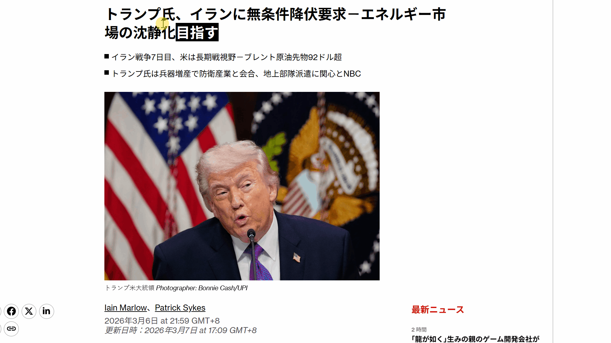

<h1> AI划词解释</h1>

   

你在在看一篇英文文章，某个词卡住了
复制 📋 → 切换搜索引擎 🌐 → 粘贴 📝 → 等待加载 ⏳ ... 终于找到解释 ✅
但刚才看到哪了？刚才上下文里，是这个意思么？

阅读节奏碎了一地。其实你只想知道：**在这个句子里，这个词到底什么意思？**

> **选中 → AI基于上下文理解 → 给出答案**
> 
> 轻量、无广告、专注阅读效率 | 快 · 懂你 · 安全

---

## ✨ 核心功能

| | |
|:---:|:---|
| 🎯 **AI 划词解释** | 选中文字，悬浮立刻显示 AI 解释与翻译 |
| 🧠 **上下文理解** | 基于当前页面内容智能分析，给出更准确的释义 |
| 🇯🇵 **日语假名流式标注** | 选中日语自动标注假名，汉字读音一目了然 |
| 📖 **双语字幕式翻译** | 原文+译文对照阅读，完美支持英语/日语/外文网站 |
| ⚡ **轻量简单** | 极简设计，无广告打扰，安装即用 |
| 🔧 **灵活配置** | 支持内置 API 或自行配置 DeepSeek/OpenAI/Claude 等 |

---

## 🚀 适合谁用？

| 目标用户 | |
|:---|:---|
| 🌏 外语学习者 | 💻 程序员 |
| 📚 文献阅读者 | ✈️ 留学党 |
| 🇯🇵 日语爱好者 | 🌍 多语言工作者 |

安装即用，提升你 **80%** 的外文阅读效率

---

## 🔐 隐私与安全

| | |
|:---|:---|
| 💾 **本地存储** | 你的 API Key 保存在浏览器本地 |
| 🔒 **无数据收集** | 不向任何服务器上传用户数据 |
| ⚔️ **最小权限** | 仅请求功能所需的必要权限 |

---

## ❓ 常见问题

<strong>AI划词解释是免费的吗？</strong>

扩展程序免费安装。你只需支付所使用的 AI API 调用费用（DeepSeek、OpenAI 等）。大多数提供商都有慷慨的免费额度。

<strong>没有 API 也能用吗？</strong>

可以！插件内置了免费大模型 API，无需配置即可直接使用。每日有限次免费额度，用完可自行配置 API Key 继续使用。

<strong>支持哪些语言？</strong>

支持 AI 模型所支持的所有语言 — 包括英语、中文、日语、韩语、西班牙语、法语、德语等。

<strong>在所有网站都能用吗？</strong>

大多数网站都支持。不支持 chrome:// 系统页面和部分受限域名。

---

⭐ 如果对你有帮助，欢迎给我们一个 Star

---

*用 ❤️ 让外语阅读不再困难*

